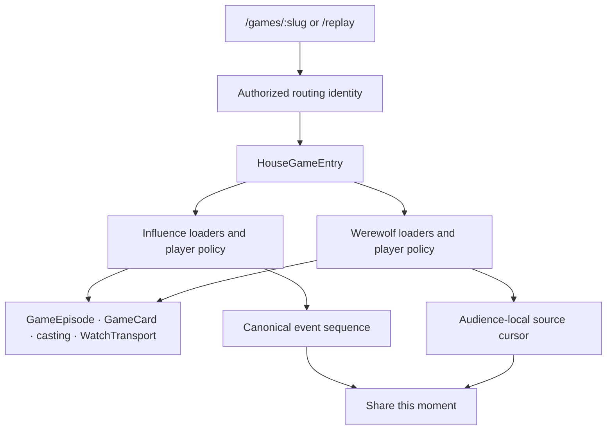

# House entry and replay moments

Two game engines need one product entry without pretending their gameplay data is interchangeable. A Werewolf role, audience cursor and faction outcome are not Influence persona, event sequence or jury results.

## Implemented boundary

`GET /api/game-entries/:idOrSlug` returns exactly `{ id, slug, gameKind }`. It is an optional-auth, private/no-store read. Public games work signed out; hidden/missing identities return 404. Private Influence retains owner, participant and operator access through the existing visibility predicate. Werewolf creation remains public-only, and private Werewolf identities fail closed pending W7 transport parity. Malformed configuration is an error, not another game kind.

Resolve identity before metadata, detail or game-specific presentation. Never probe an Influence endpoint and interpret 409, 404 or a network failure as Werewolf. Successful anonymous SSR identity seeds the client immediately. An anonymous SSR 404 allows the existing authenticated client transport to retry once auth becomes ready. This does not require signing in to public games. Detail/watch/media still enforce their own access because callers can bypass entry entirely.

`GameEpisode`, `GameCard`, `CastingRoster`, `CastCard`, `CastInvitation`, `CastPortraitDialog` and `GameSiteEntry` own presentational structure. Concrete modules own fetching, permissions, lifecycle and actions. Influence retains episode preview/trailer loading and hover activation. Werewolf uses safe casting data and House artwork without loading roles or pack imagery on entry. The public Werewolf module now lives in `components/games/werewolf/`; `/werewolf/:slug` has no compatibility route. Internal API/admin paths remain game-specific.

A single `join_game` agent-creation flow resolves identity before joining through the corresponding API. Preserve draft recovery and both games' separate strategy fields. Do not infer a game from a URL prefix or reuse Influence strategy for Werewolf.

## Replay links

- Influence: `/games/:slug/replay/:sequence`, using the active cue's canonical event sequence.
- Werewolf: `/games/:slug/replay?audience=mystery|omniscient&cursor=N`, using the active source entry's audience-local cursor.
- Never put a cue-array index, pagination page or elapsed animation time into the link. Werewolf requires an explicit valid audience with a cursor; repeated/invalid parameters are rejected. A cursor in one audience cannot be reused for the other.
- The common transport offers **Share this moment** in settings. It reuses native sharing/clipboard feedback and does not seek or pause. Moments with no stable source anchor have no share action.
- Resolve the initial position before loading/autoplaying the director. Werewolf starts in the target 32-entry window, preserving saved thinking/order and audience restrictions. Later fetches must not overwrite a seek or unpause a paused viewer.
- Influence retains its existing sequence resolver: exact first cue, otherwise next available cue, otherwise last cue. This is deliberately distinct from Werewolf's rejected out-of-range initial cursor. Tightening historical Influence clamping is a follow-up, not an invented cross-game equivalence.
- Links load currently permitted published media, not an immutable historical image version. A link grants no authorization.

## Adding a third game

1. Add its explicit database/identity kind and define public/private visibility in both routing and direct transports. Do not assume entry authorization protects media.
2. Implement concrete entry/casting/watch modules. Supply presentation props to the existing House components; add game-specific rules and metadata content only where needed.
3. Define one stable replay source coordinate and any audience boundary. Add typed link generation, strict parameter parsing and initial-position loading. Reuse the shared share action.
4. Keep canonical facts, participant identity and accepted decisions in that game's projections. Never parse dialogue into routing, outcomes or replay coordinates.
5. Test anonymous entry, private/hidden denial, create-and-join recovery, audience restrictions, completed/live playback and share roundtrips with actual browser assertions. Add results/editorial/MCP modules through the same House routes when they exist.

## Verification lessons

Use Bun provider-free tests for parsers/components/recovery; PostgreSQL tests for access; isolated Puppeteer tests for real Werewolf API journeys; deterministic Playwright fixtures for Influence playback. Review screenshots in addition to DOM assertions. Real auth, provider/image generation, staging and external writes remain separate opt-ins.

Do not run the two browser harnesses concurrently in one checkout: both currently use `.next/e2e` and contend for Next's dev lock. They also rewrite generated Next type includes; restore those generated-only edits after shutdown before running the repository check. Existing shared `influence_test` can have migration-ledger drift when different worktrees use different experimental migrations. Run the baseline against a fresh isolated database instead of replaying or rewriting the operator's development DB. Always pass `database.databaseUrl` to `destroyIsolatedTestDb`, and clean only your own isolated database.

See [implementation evidence and remaining boundaries](../../reviews/2026-10-02-house-game-entry-implementation.md).

## Creation options follow active behavior

On 2026-10-02 the creation-time `viewerMode` and `timingPreset` options were removed, along with unused phase timers and the unconnected server event pacer. Trace a setting to its runtime consumer before copying it into another game. The House player already owns playback preferences; game configuration retains actual game-length limits. Visibility and visual-failure policy are shared product contracts, but parity requires authorization and durable runtime behavior as well as identical form controls. Track those remaining contracts in W7 of the integration roadmap.
